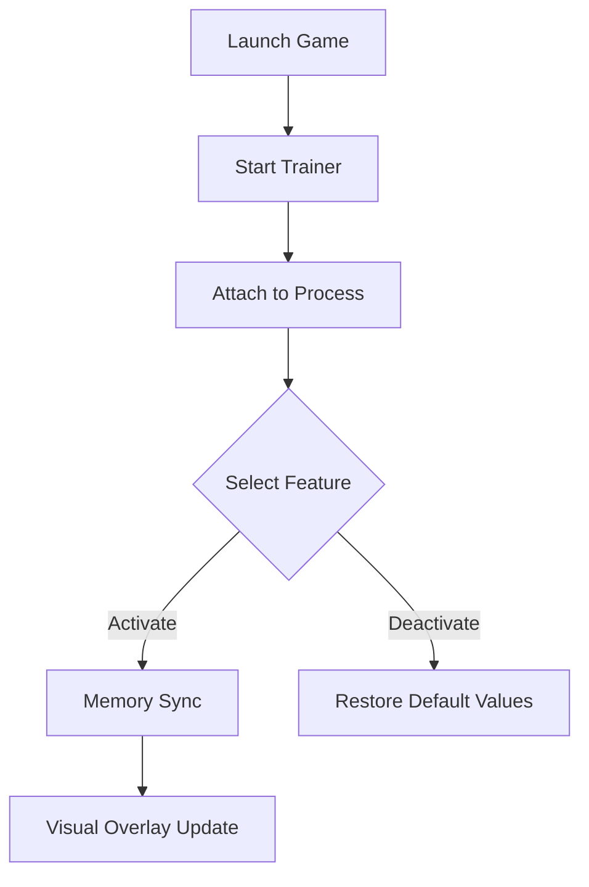

# Not Raised By Wolves Trainer – Precision Control & Exploration Boost Tool 🐺

The **Not Raised By Wolves Trainer** is a finely tuned software companion that gives players direct control over survival parameters, stamina balance, and combat pacing. Designed for **Windows PC**, this tool offers smooth real-time integration, allowing you to explore freely, experiment with resource values, and enjoy the world without unnecessary grind.

---

## 🧭 Overview

Built for immersion and balance, the trainer interacts directly with in-game systems to enhance quality-of-life — without altering save data or causing instability. Whether you’re exploring dangerous terrain or managing scarce materials, this trainer keeps your progression fluid and customizable.

> [!IMPORTANT]
> Use the trainer responsibly — it’s meant for solo play and creative exploration, not competitive sessions.


---

## ⚙️ Core Features

* **Infinite Stamina Mode:** Run, climb, and fight continuously without exhaustion.
* **Health Stabilizer:** Prevent sudden damage spikes or passive bleed-outs during longer fights.
* **Material Multiplier:** Increase harvest and loot rates for faster crafting progress.
* **Temperature Lock:** Maintain an ideal body temperature during environmental shifts.
* **Stealth Boost:** Temporarily reduce detection from wildlife and hostile NPCs.
* **Hotkey Panel:** Map your favorite modifiers (`F1`–`F8`) for on-the-fly toggling.
* **Adaptive Overlay:** Minimalist interface with optional FPS-safe mode for low-end systems.

---

## 💻 Compatibility

| Platform           | Build            | Support            |
| ------------------ | ---------------- | ------------------ |
| Windows 10 / 11    | x64              | ✅ Full Support     |
| Steam / Epic / GOG | All Versions     | ✅ Compatible       |
| Controller Input   | Xbox / DualSense | ⚙️ Supported       |
| Linux (Proton)     | Partial          | ⚠️ Overlay Limited |

> [!NOTE]
> The trainer runs best when paired with **DirectX 12 mode** enabled from in-game settings.

---

## ⚡ Setup & Usage

1. **Download** the trainer package (`NotRaisedByWolvesTrainer.zip`).
2. **Extract** into your main game directory.
3. **Run** `NRBW_Trainer.exe` as Administrator.
4. Launch *Not Raised By Wolves* and wait until gameplay begins.
5. Use hotkeys or the overlay panel to activate desired modules.

Sample configuration block:

```ini
[TrainerConfig]
InfiniteStamina=True
MaterialMultiplier=2.5
TemperatureLock=True
StealthMode=False
OverlayTransparency=0.85
```

> [!WARNING]
> Avoid stacking conflicting stamina and health modifiers — may cause temporary HUD desyncs.

---

## 🧩 Function Flow



---

## ❓ FAQ

**Q1: Is this trainer compatible with future patches?**
Yes, the internal memory map auto-updates on game version change, minimizing downtime.

**Q2: Can I customize hotkeys?**
Yes, edit `hotkeys.ini` or change bindings from the in-game overlay directly.

**Q3: Does it affect saves or progress tracking?**
No, all changes are runtime-based and revert once the trainer is closed.

**Q4: Will it work on Steam Deck?**
Yes, under Proton with the overlay in borderless mode (performance mode recommended).

**Q5: How can I uninstall it?**
Simply delete the trainer folder; no registry edits or residual files remain.

---

## 🧠 Advanced Configs

Players can automate certain functions by scripting lightweight triggers:

```lua
if player.health < 30 then
    trainer.enable("GodMode")
end
```

This allows adaptive protection during boss fights or exploration without constant toggling.

---

## 🌐 Community & Support

Join the official forum for configuration sharing, mod integration, and beta updates. Contribute ideas for balancing or request new mechanics for upcoming releases.

---

### Final Thoughts

The **Not Raised By Wolves Trainer** transforms your survival journey into a customizable experience. With stability-tested options and dynamic toggles, you can tailor the world’s danger level to match your playstyle — from methodical exploration to pure adventure freedom.

> Explore boldly. Tame the wilderness on your terms — **download the trainer and evolve your gameplay today.**
